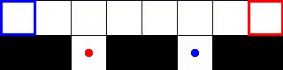
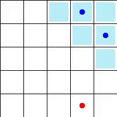

# ma-gym
Multi Agent Environments for OpenAI gym

## Installation
```bash
cd ma-gym
pip install -e .
```

## Usage:
```bash
>>> import gym
>>> import ma_gym
>>> env = gym.make('CrossOver-v0')
>>> env.n_agents        # number of agents
2
>>> env.action_space    # list of action_space of each agent
[Discrete(5), Discrete(5)]
>>>
>>> env.reset()         # list of observation of each agent
[[0.5, 0.25], [0.5, 0.625]]
>>>
>>> one_hot_actions = [[0 for _ in range(agent_action.n)] for agent_action in env.action_space]
>>> for agent_i,agent_action in enumerate(env.action_space):
...    one_hot_actions[agent_i][agent_action.sample()] = 1
>>> one_hot_actions   
[[0, 0, 0, 0, 1], [0, 0, 1, 0, 0]]
>>>
>>> obs_n,reward_n,done_n,info=env.step(one_hot_actions)
>>> obs_n
[[0.5, 0.25], [0.0, 0.625]]
>>> reward_n        # reward of each agent
[0, 0] 
>>> done_n          # terminal flag of each agent
[False, False]
>>> info
{}
```

## Environments:


| Name  | Description |
| ------------- | ------------- |
| CrossOver-v0  |  Partially Observability  |
| CrossOver-v1  | Full Observability  |

## Demo



