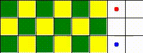
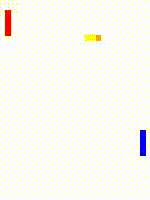

# ma-gym
Multi Agent Environments for OpenAI gym

## Installation
```bash
cd ma-gym
python setup.py install # use 'develop' instead of 'install' if developing the package
```

## Usage:
```python
import gym
import ma_gym

env = gym.make('CrossOver-v0')
done_n = [False for _ in range(env.n_agents)]
ep_reward = 0

obs_n = env.reset()
while not all(done_n):
    env.render()
    obs_n, reward_n, done_n, info = env.step(env.action_space.sample())
    ep_reward += sum(reward_n)
env.close()
```

Please refer to [Wiki](https://github.com/koulanurag/ma-gym/wiki) for complete usage details

## Environments:
- [x] CrossOver
- [ ] Fetch
- [x] Checkers
- [x] PredatorPrey
- [ ] Combat
- [ ] Traffic Junction

```
Note : openai's environment can be accessed in multi agent form by prefix "ma_".Eg: ma_CartPole-v0
This returns an instance of CartPole-v0 wrapped around multi agent from having a single agent. 
These environments are helpful during debugging.
```

Please refer to [Wiki](https://github.com/koulanurag/ma-gym/wiki) for more details

## Zoo!
|PredatorPrey5x5-v0|Checkers-v0|CrossOver-v0|
| ---- |----|---|
||||

|Fetch-v0|Combat-v0|TrafficJunction-v0|
| ---- |----|---|
||||

|PongDuel-v0|
| ---- |
||


